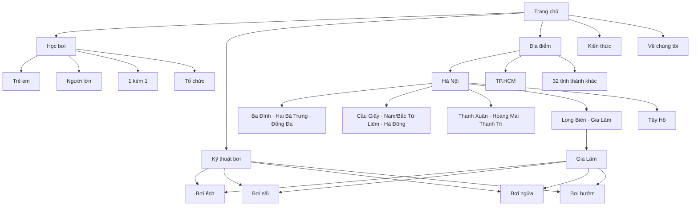

# Kiến trúc website & SEO địa phương — dayboi.vip

Cập nhật: 09/09/2026

## 1. Kết luận rà soát

Website là mô hình lai gồm: năng lực đào tạo cho tổ chức, nội dung hướng dẫn bơi và danh bạ địa phương cho người học cá nhân. Trước lần tái cấu trúc này, build có 156 URL nhưng điều hướng chính không phản ánh đầy đủ ba nhóm ý định trên. Dữ liệu Hà Nội đã chia theo quận/huyện nhưng bị dồn vào các anchor của một trang dài, khiến từng khu vực không có metadata, breadcrumb và mạng liên kết riêng.

Các vấn đề ưu tiên cao đã xử lý:

1. Tạo cấu trúc địa điểm ba tầng: hub toàn quốc → tỉnh/thành → quận/huyện.
2. Chỉ xuất bản trang quận/huyện khi qua cổng chất lượng dữ liệu; không sinh hàng loạt trang chỉ thay tên địa phương.
3. Gom toàn bộ từ khóa kiểu bơi của một khu vực vào một landing page, sau đó liên kết sang hub kỹ thuật tương ứng để tránh cannibalization.
4. Sửa tiêu đề toàn site để không lặp thương hiệu và giảm tình trạng title quá dài.
5. Đưa “Học bơi” thành nhóm điều hướng cấp một, tách rõ với “Kỹ thuật”, “Địa điểm” và “Kiến thức”.
6. Sửa dữ liệu Aqua-Tots Gia Lâm và Cầu Giấy theo trang cơ sở chính thức; loại listing tự dẫn nguồn hoặc chưa chứng minh được dịch vụ dạy bơi.
7. Đặt `noindex, follow` cho các trang lưu trữ thẻ mỏng; bài viết và danh mục chính vẫn được crawl qua liên kết nội bộ nhưng sitemap không bị pha loãng.
8. Đồng bộ taxonomy blog với danh mục thực tế và sửa slug/canonical bài lớp người lớn, loại bỏ mạng liên kết trỏ tới các URL không tồn tại.

Kết quả build hiện có 169 route và 13 landing page quận/huyện Hà Nội qua cổng chất lượng. Audit output kiểm 186 tệp HTML, không phát hiện liên kết nội bộ hỏng; toàn bộ landing page đều có trong sitemap, title và meta description đúng ngưỡng, canonical riêng, đúng một H1 và schema CollectionPage/ItemList/FAQPage. Audit toàn site trước đó có 140 trang indexable, không có title hoặc description trùng hoàn toàn. Các outlier metadata còn lại thuộc nhóm trang cũ và cần được biên tập dần theo từng trang thay vì cắt máy móc.

## 2. Cây website mục tiêu

```text
Trang chủ (/)
├── Học bơi (/khoa-hoc-boi/)
│   ├── Trẻ em (/khoa-hoc-boi/tre-em/)
│   ├── Người lớn (/khoa-hoc-boi/nguoi-lon/)
│   ├── 1 kèm 1 (/khoa-hoc-boi/1-kem-1/)
│   ├── Người sợ nước (/khoa-hoc-boi/nguoi-so-nuoc/)
│   ├── Nhóm (/khoa-hoc-boi/nhom/)
│   └── Tổ chức (/khoa-hoc-boi/doanh-nghiep/)
├── Kỹ thuật bơi (/ky-thuat-boi/)
│   ├── Bơi ếch (/ky-thuat-boi/hoc-boi-ech/)
│   ├── Bơi sải (/ky-thuat-boi/hoc-boi-sai/)
│   ├── Bơi ngửa (/ky-thuat-boi/hoc-boi-ngua/)
│   ├── Bơi bướm (/ky-thuat-boi/hoc-boi-buom/)
│   └── Đứng nước (/ky-thuat-boi/ky-nang-dung-nuoc/)
├── Địa điểm (/hoc-boi-o-dau/)
│   ├── Hà Nội (/hoc-boi-ha-noi/)
│   │   ├── Ba Đình (/hoc-boi-ha-noi/ba-dinh/)
│   │   ├── Hai Bà Trưng (/hoc-boi-ha-noi/hai-ba-trung/)
│   │   ├── Đống Đa (/hoc-boi-ha-noi/dong-da/)
│   │   ├── Thanh Xuân (/hoc-boi-ha-noi/thanh-xuan/)
│   │   ├── Cầu Giấy (/hoc-boi-ha-noi/cau-giay/)
│   │   ├── Gia Lâm (/hoc-boi-ha-noi/gia-lam/)
│   │   ├── Long Biên (/hoc-boi-ha-noi/long-bien/)
│   │   ├── Hoàng Mai (/hoc-boi-ha-noi/hoang-mai/)
│   │   ├── Nam Từ Liêm (/hoc-boi-ha-noi/nam-tu-liem/)
│   │   ├── Tây Hồ (/hoc-boi-ha-noi/tay-ho/)
│   │   ├── Bắc Từ Liêm (/hoc-boi-ha-noi/bac-tu-liem/)
│   │   ├── Thanh Trì (/hoc-boi-ha-noi/thanh-tri/)
│   │   └── Hà Đông (/hoc-boi-ha-noi/ha-dong/)
│   ├── TP.HCM (/hoc-boi-tphcm/)
│   ├── Đà Nẵng (/hoc-boi-da-nang/)
│   └── 31 tỉnh/thành còn lại
├── Kiến thức (/tin-tuc/)
│   ├── Hướng dẫn
│   ├── Bơi lội trẻ em
│   ├── An toàn bơi lội
│   └── Góc tư vấn
├── Giới thiệu (/gioi-thieu/)
├── Đội ngũ (/doi-ngu-hlv/)
└── Liên hệ (/lien-he/)
```

## 3. Visual sitemap



## 4. URL map trọng tâm

| Trang | URL | Trang cha | Vị trí điều hướng | Ưu tiên |
|---|---|---|---|---|
| Học bơi | `/khoa-hoc-boi/` | Trang chủ | Header | Cao |
| Kỹ thuật bơi | `/ky-thuat-boi/` | Trang chủ | Header | Cao |
| Danh bạ toàn quốc | `/hoc-boi-o-dau/` | Trang chủ | Header | Cao |
| Học bơi Hà Nội | `/hoc-boi-ha-noi/` | Danh bạ | Header dropdown | Cao |
| Học bơi Gia Lâm | `/hoc-boi-ha-noi/gia-lam/` | Hà Nội | Hub, tỉnh, footer | Cao |
| Học bơi Long Biên | `/hoc-boi-ha-noi/long-bien/` | Hà Nội | Hub, tỉnh, footer | Cao |
| 11 quận/huyện Hà Nội còn lại | `/hoc-boi-ha-noi/{quan-huyen}/` | Hà Nội | Hub, tỉnh, liên kết chéo theo địa lý | Cao |
| Kiến thức | `/tin-tuc/` | Trang chủ | Header | Trung bình |

Các URL ngắn như `/hoc-boi-gia-lam/` được 301 sang URL phân cấp để vừa giữ khả năng truy cập theo thói quen vừa duy trì một canonical duy nhất.

## 5. Bản đồ từ khóa

Một landing page quận/huyện sở hữu toàn bộ cụm ý định địa phương:

- Primary: `học bơi {khu vực}` và `học bơi ở {khu vực}`.
- Secondary: `dạy bơi {khu vực}`, `lớp học bơi {khu vực}`, `bể bơi {khu vực}`.
- Supporting: `học bơi ếch {khu vực}`, `học bơi sải {khu vực}`, `học bơi ngửa {khu vực}`, `học bơi bướm {khu vực}`.

Không tạo bốn URL địa phương riêng cho bốn kiểu bơi. Landing page khu vực trả lời ý định tìm lớp; trang kỹ thuật trả lời ý định học phương pháp. Cách phân vai này giảm cạnh tranh nội bộ giữa các URL.

## 6. Cổng chất lượng landing page địa phương

Một quận/huyện chỉ được đưa vào `publishedLocationAreas` khi thỏa tất cả điều kiện:

1. Có ít nhất hai địa điểm thực tế.
2. Mỗi địa điểm có chủ thể liên hệ bể bơi và URL nguồn HTTPS cụ thể.
3. Mỗi địa điểm có ít nhất một đầu mối lớp học và URL nguồn cụ thể.
4. Không dùng homepage chung hoặc chính dayboi.vip làm nguồn xác thực.
5. Trang cung cấp dữ liệu địa phương thật: địa chỉ, quyền tiếp cận, môi trường bể, liên hệ và lưu ý cần xác nhận.

Các quận/huyện chưa đạt cổng vẫn xuất hiện dưới dạng nhóm nội dung trong trang Hà Nội, nhưng chưa có URL indexable riêng. Sau khi nghiên cứu bổ sung, chúng tự động đủ điều kiện để đi vào build.

## 7. Navigation spec

- Header: Trang chủ → Học bơi → Kỹ thuật bơi → Địa điểm → Về chúng tôi → Kiến thức → CTA hợp tác.
- Footer: Chương trình tổ chức, kỹ thuật bơi và các landing page địa điểm nổi bật.
- Breadcrumb địa phương: Trang chủ → Địa điểm → Hà Nội → Quận/huyện.
- Trang tỉnh/thành: liên kết đến landing page quận/huyện đủ chất lượng; khu vực chưa đủ dữ liệu vẫn dùng anchor.
- Trang quận/huyện: liên kết ngược về Hà Nội, liên kết chéo bốn quận gần hoặc có hành trình phù hợp và liên kết sang bốn hub kỹ thuật.

## 8. Việc tiếp theo theo thứ tự ưu tiên

1. Áp dụng cùng cổng chất lượng cho quận/huyện TP.HCM; hợp nhất URL Tân Bình hiện tại vào cây `/hoc-boi-tphcm/tan-binh/` bằng 301 khi dữ liệu đạt chuẩn.
2. Bổ sung kiểm tra định kỳ trạng thái HTTP và ngày xác minh của từng nguồn ngoài để phát hiện URL chết hoặc thông tin cũ.
3. Dùng Google Search Console theo dõi coverage, query/click của từng tầng URL và phát hiện cannibalization.
4. Đo Core Web Vitals sau triển khai, ưu tiên LCP của hero và tổng kích thước CSS ở landing page địa phương.
