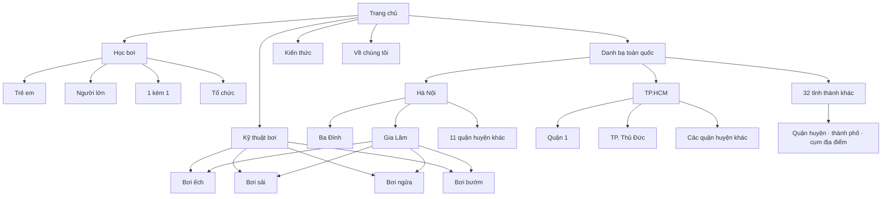

# Kiến trúc website & SEO địa phương — dayboi.vip

Cập nhật: 09/09/2026

## 1. Kết luận rà soát

Website là mô hình lai gồm: năng lực đào tạo cho tổ chức, nội dung hướng dẫn bơi và danh bạ địa phương cho người học cá nhân. Trước lần tái cấu trúc này, build có 156 URL nhưng điều hướng chính không phản ánh đầy đủ ba nhóm ý định trên. Dữ liệu Hà Nội đã chia theo quận/huyện nhưng bị dồn vào các anchor của một trang dài, khiến từng khu vực không có metadata, breadcrumb và mạng liên kết riêng.

Các vấn đề ưu tiên cao đã xử lý:

1. Tạo cấu trúc địa điểm ba tầng: hub toàn quốc → tỉnh/thành → quận/huyện hoặc cụm địa phương.
2. Chỉ xuất bản trang quận/huyện khi qua cổng chất lượng dữ liệu; không sinh hàng loạt trang chỉ thay tên địa phương.
3. Gom toàn bộ từ khóa kiểu bơi của một khu vực vào một landing page, sau đó liên kết sang hub kỹ thuật tương ứng để tránh cannibalization.
4. Sửa tiêu đề toàn site để không lặp thương hiệu và giảm tình trạng title quá dài.
5. Đưa “Học bơi” thành nhóm điều hướng cấp một, tách rõ với “Kỹ thuật”, “Địa điểm” và “Kiến thức”.
6. Sửa dữ liệu Aqua-Tots Gia Lâm và Cầu Giấy theo trang cơ sở chính thức; loại listing tự dẫn nguồn hoặc chưa chứng minh được dịch vụ dạy bơi.
7. Đặt `noindex, follow` cho các trang lưu trữ thẻ mỏng; bài viết và danh mục chính vẫn được crawl qua liên kết nội bộ nhưng sitemap không bị pha loãng.
8. Đồng bộ taxonomy blog với danh mục thực tế và sửa slug/canonical bài lớp người lớn, loại bỏ mạng liên kết trỏ tới các URL không tồn tại.

Kết quả build hiện có 181 route và 25 landing page quận/huyện/khu vực qua cổng chất lượng: 13 trang Hà Nội và 12 trang TP.HCM. Audit kiểm 210 tệp HTML, xác định 159 URL indexable và 29 URL chuyển hướng; không có title hoặc description trùng hoàn toàn. Toàn bộ landing page có canonical riêng, đúng một H1 và schema CollectionPage/ItemList/FAQPage. URL Tân Bình cũ đã được chuyển hướng về cấu trúc mới. 62 ảnh JPEG đã được nén từ 208,9 MB xuống 22,4 MB và 216 thẻ ảnh được bổ sung kích thước để hạn chế xô lệch bố cục.

## 2. Cây website mục tiêu

```text
Trang chủ (/)
├── Học bơi (/khoa-hoc-boi/)
│   ├── Trẻ em (/khoa-hoc-boi/tre-em/)
│   ├── Người lớn (/khoa-hoc-boi/nguoi-lon/)
│   ├── 1 kèm 1 (/khoa-hoc-boi/1-kem-1/)
│   ├── Người sợ nước (/khoa-hoc-boi/nguoi-so-nuoc/)
│   ├── Nhóm (/khoa-hoc-boi/nhom/)
│   └── Tổ chức (/khoa-hoc-boi/doanh-nghiep/)
├── Kỹ thuật bơi (/ky-thuat-boi/)
│   ├── Bơi ếch (/ky-thuat-boi/hoc-boi-ech/)
│   ├── Bơi sải (/ky-thuat-boi/hoc-boi-sai/)
│   ├── Bơi ngửa (/ky-thuat-boi/hoc-boi-ngua/)
│   ├── Bơi bướm (/ky-thuat-boi/hoc-boi-buom/)
│   └── Đứng nước (/ky-thuat-boi/ky-nang-dung-nuoc/)
├── Danh bạ toàn quốc (/hoc-boi-o-dau/)
│   ├── Hà Nội (/hoc-boi-ha-noi/)
│   │   ├── Ba Đình (/hoc-boi-ha-noi/ba-dinh/)
│   │   ├── Hai Bà Trưng (/hoc-boi-ha-noi/hai-ba-trung/)
│   │   ├── Đống Đa (/hoc-boi-ha-noi/dong-da/)
│   │   ├── Thanh Xuân (/hoc-boi-ha-noi/thanh-xuan/)
│   │   ├── Cầu Giấy (/hoc-boi-ha-noi/cau-giay/)
│   │   ├── Gia Lâm (/hoc-boi-ha-noi/gia-lam/)
│   │   ├── Long Biên (/hoc-boi-ha-noi/long-bien/)
│   │   ├── Hoàng Mai (/hoc-boi-ha-noi/hoang-mai/)
│   │   ├── Nam Từ Liêm (/hoc-boi-ha-noi/nam-tu-liem/)
│   │   ├── Tây Hồ (/hoc-boi-ha-noi/tay-ho/)
│   │   ├── Bắc Từ Liêm (/hoc-boi-ha-noi/bac-tu-liem/)
│   │   ├── Thanh Trì (/hoc-boi-ha-noi/thanh-tri/)
│   │   └── Hà Đông (/hoc-boi-ha-noi/ha-dong/)
│   ├── TP.HCM (/hoc-boi-tphcm/)
│   │   ├── Quận 1 (/hoc-boi-tphcm/quan-1/)
│   │   ├── Quận 3 (/hoc-boi-tphcm/quan-3/)
│   │   ├── Quận 4 (/hoc-boi-tphcm/quan-4/)
│   │   ├── Quận 10 (/hoc-boi-tphcm/quan-10/)
│   │   ├── Quận 12 (/hoc-boi-tphcm/quan-12/)
│   │   ├── Phú Nhuận (/hoc-boi-tphcm/phu-nhuan/)
│   │   ├── Tân Bình (/hoc-boi-tphcm/tan-binh/)
│   │   ├── Bình Thạnh (/hoc-boi-tphcm/binh-thanh/)
│   │   ├── Gò Vấp (/hoc-boi-tphcm/go-vap/)
│   │   ├── Thủ Đức (/hoc-boi-tphcm/thu-duc/)
│   │   ├── Hóc Môn (/hoc-boi-tphcm/hoc-mon/)
│   │   └── Bình Dương (/hoc-boi-tphcm/binh-duong/)
│   ├── Đà Nẵng (/hoc-boi-da-nang/)
│   └── 31 tỉnh/thành còn lại
├── Kiến thức (/tin-tuc/)
│   ├── Hướng dẫn
│   ├── Bơi lội trẻ em
│   ├── An toàn bơi lội
│   └── Góc tư vấn
├── Giới thiệu (/gioi-thieu/)
├── Đội ngũ (/doi-ngu-hlv/)
└── Liên hệ (/lien-he/)
```

## 3. Visual sitemap



Trong giao diện danh bạ, ba cấp địa phương được hiển thị bằng một cây duy nhất:

```text
Toàn quốc
└── Tỉnh/thành phố
    └── Quận/huyện, thành phố trực thuộc hoặc cụm địa điểm
```

Tỉnh/thành và địa phương con không còn xuất hiện như các thẻ ngang cấp. Trang khu vực chỉ được mở thành URL riêng khi qua cổng chất lượng; nếu chưa đủ dữ liệu, nút cấp ba dẫn tới đúng nhóm nội dung trên trang tỉnh/thành. Các bể bơi và lớp học là dữ liệu chi tiết bên trong cấp ba, không tạo thêm một tầng URL hàng loạt.

## 4. URL map trọng tâm

| Trang | URL | Trang cha | Vị trí điều hướng | Ưu tiên |
|---|---|---|---|---|
| Học bơi | `/khoa-hoc-boi/` | Trang chủ | Header | Cao |
| Kỹ thuật bơi | `/ky-thuat-boi/` | Trang chủ | Header | Cao |
| Danh bạ toàn quốc | `/hoc-boi-o-dau/` | Trang chủ | Header | Cao |
| Học bơi Hà Nội | `/hoc-boi-ha-noi/` | Danh bạ | Header dropdown | Cao |
| Học bơi Gia Lâm | `/hoc-boi-ha-noi/gia-lam/` | Hà Nội | Hub, tỉnh, footer | Cao |
| Học bơi Long Biên | `/hoc-boi-ha-noi/long-bien/` | Hà Nội | Hub, tỉnh, footer | Cao |
| 11 quận/huyện Hà Nội còn lại | `/hoc-boi-ha-noi/{quan-huyen}/` | Hà Nội | Hub, tỉnh, liên kết chéo theo địa lý | Cao |
| Học bơi TP.HCM | `/hoc-boi-tphcm/` | Danh bạ | Header dropdown | Cao |
| 12 khu vực TP.HCM đủ nguồn | `/hoc-boi-tphcm/{khu-vuc}/` | TP.HCM | Hub, tỉnh/thành, liên kết chéo theo địa lý | Cao |
| Kiến thức | `/tin-tuc/` | Trang chủ | Header | Trung bình |

Các URL ngắn như `/hoc-boi-gia-lam/` được 301 sang URL phân cấp để vừa giữ khả năng truy cập theo thói quen vừa duy trì một canonical duy nhất.

## 5. Bản đồ từ khóa

Một landing page quận/huyện sở hữu toàn bộ cụm ý định địa phương:

- Primary: `học bơi {khu vực}` và `học bơi ở {khu vực}`.
- Secondary: `dạy bơi {khu vực}`, `lớp học bơi {khu vực}`, `bể bơi {khu vực}`.
- Supporting: `học bơi ếch {khu vực}`, `học bơi sải {khu vực}`, `học bơi ngửa {khu vực}`, `học bơi bướm {khu vực}`.

Không tạo bốn URL địa phương riêng cho bốn kiểu bơi. Landing page khu vực trả lời ý định tìm lớp; trang kỹ thuật trả lời ý định học phương pháp. Cách phân vai này giảm cạnh tranh nội bộ giữa các URL.

## 6. Cổng chất lượng landing page địa phương

Một quận/huyện chỉ được đưa vào `publishedLocationAreas` khi thỏa tất cả điều kiện:

1. Có ít nhất hai địa điểm thực tế.
2. Mỗi địa điểm có chủ thể liên hệ bể bơi và URL nguồn HTTPS cụ thể.
3. Mỗi địa điểm có ít nhất một đầu mối lớp học và URL nguồn cụ thể.
4. Không dùng homepage chung hoặc chính dayboi.vip làm nguồn xác thực.
5. Trang cung cấp dữ liệu địa phương thật: địa chỉ, quyền tiếp cận, môi trường bể, liên hệ và lưu ý cần xác nhận.

Các quận/huyện chưa đạt cổng vẫn xuất hiện dưới dạng nhóm nội dung trong trang tỉnh/thành, nhưng chưa có URL indexable riêng. Tại TP.HCM, nhóm này hiện gồm Quận 5, Quận 7, Quận 8, Quận 11 và Bà Rịa – Vũng Tàu. Sau khi nghiên cứu bổ sung, chúng tự động đủ điều kiện để đi vào build.

## 7. Navigation spec

- Header: Trang chủ → Học bơi → Kỹ thuật bơi → Địa điểm → Về chúng tôi → Kiến thức → CTA hợp tác.
- Footer: Chương trình tổ chức, kỹ thuật bơi và các landing page địa điểm nổi bật.
- Breadcrumb địa phương: Trang chủ → Toàn quốc → tỉnh/thành → quận/huyện hoặc khu vực quen dùng.
- Hub danh bạ hiển thị trực tiếp 34 tỉnh/thành và 121 địa phương con theo cây đóng/mở; tìm kiếm được theo cả tỉnh, quận/huyện và tên bể bơi.
- Trang tỉnh/thành: liên kết đến landing page quận/huyện đủ chất lượng; khu vực chưa đủ dữ liệu vẫn dùng anchor.
- Trang quận/huyện: liên kết ngược về tỉnh/thành, liên kết chéo bốn khu vực gần hoặc có hành trình phù hợp và liên kết sang bốn hub kỹ thuật.

## 8. Dữ liệu từ khóa đầu vào

Nguồn phân tích là workbook `Bộ từ khóa đầy đủ học bơi.xlsx`. Sau khi loại dòng trống và gộp từ khóa trùng, tệp có khoảng 1.859 từ khóa; tổng lượng tìm kiếm tham khảo của cụm “học bơi” là 22.450.

| Cụm từ khóa | Lượng tìm kiếm tham khảo | Trang sở hữu |
|---|---:|---|
| học bơi | 2.400 | `/` và hub `/khoa-hoc-boi/`, phân vai theo ý định |
| học bơi ếch | 720 | `/ky-thuat-boi/hoc-boi-ech/` |
| học bơi Hà Nội | 480 | `/hoc-boi-ha-noi/` |
| học bơi sải | 480 | `/ky-thuat-boi/hoc-boi-sai/` |
| cách học bơi | 480 | `/cach-hoc-boi/` |
| cách học bơi nhanh nhất | 390 | `/cach-hoc-boi-nhanh-nhat/` |
| học bơi trẻ em | 320 | `/hoc-boi-tre-em/` |
| học bơi Quận 7 | 320 | trang khu vực chỉ xuất bản sau khi đủ dữ liệu |
| học bơi ở đâu | 260 | `/hoc-boi-o-dau/` |
| học bơi cho người lớn | 170 | `/hoc-boi-nguoi-lon/` |
| học bơi Gò Vấp | 170 | `/hoc-boi-tphcm/go-vap/` |
| học bơi Đà Nẵng | 170 | `/hoc-boi-da-nang/` |
| tự học bơi | 170 | `/tu-hoc-boi/` |

Hai nhóm truy vấn cơ sở có lượng tìm kiếm đáng chú ý là “bể bơi Học viện Kỹ thuật Quân sự” (390) và “bể bơi Học viện Tài chính” (210). Chỉ tạo trang cơ sở riêng khi có đủ địa chỉ, quyền vào bể, giờ hoạt động, liên hệ, nguồn chính thức và nội dung thực sự khác trang quận.

## 9. Quy tắc phân vai từ khóa

| Ý định | Trang đích | Nội dung bắt buộc | Không làm |
|---|---|---|---|
| Tìm hiểu chung | Trang chủ | Trả lời website giúp gì, dẫn tới lớp, kỹ thuật và địa điểm | Nhồi tên tất cả tỉnh/thành vào hero |
| Chọn chương trình | Hub khóa học | So sánh đối tượng, hình thức, sĩ số, chi phí cần hỏi | Dùng giá hoặc cam kết cũ làm dữ kiện hiện hành |
| Học kỹ thuật | Trang ếch/sải/ngửa/bướm | Bài tập, lỗi sai, thứ tự luyện, lưu ý an toàn | Tạo bản sao theo từng quận/huyện |
| Tìm lớp tại địa phương | Tỉnh/thành và quận/huyện | Bể bơi thật, quyền tiếp cận, liên hệ, nguồn, khu vực gần | Tạo trang chỉ thay tên địa phương |
| Tự học/cách học | Bài hướng dẫn | Câu trả lời trực tiếp, các bước thực hành, giới hạn an toàn | Hứa biết bơi trong số buổi cố định |
| Chọn lớp cho trẻ/người lớn | Trang đối tượng | Tiêu chí chọn giáo viên, sĩ số, bể và mục tiêu đầu ra | Dùng nỗi sợ hoặc bệnh lý để thúc ép đăng ký |

## 10. Checklist SEO và AI search áp dụng cho mỗi trang

1. Title duy nhất, ưu tiên từ khóa chính ở đầu và giữ trong khoảng 45–65 ký tự khi tự nhiên.
2. Meta description 140–170 ký tự, nói rõ người dùng nhận được gì; không dùng “uy tín nhất”, “an toàn tuyệt đối” hoặc cam kết không có bằng chứng.
3. Chỉ một H1; các H2/H3 theo đúng thứ bậc và viết theo câu hỏi hoặc nhiệm vụ thật của khách hàng.
4. Phần mở đầu trả lời trực tiếp ý định trong 2–3 câu, sau đó mới giải thích chi tiết.
5. Ảnh dùng tên tệp có nghĩa, alt mô tả đúng nội dung, có `width`/`height`, lazy-load với ảnh dưới màn hình đầu tiên và nén trước khi xuất bản.
6. Mỗi trang có canonical, breadcrumb và 3–6 liên kết nội bộ đến trang cha, trang con hoặc bài hỗ trợ liên quan.
7. Schema chỉ mô tả nội dung đang hiển thị. Dùng `CollectionPage`/`ItemList` cho danh bạ, `Article` cho bài viết và `FAQPage` khi câu hỏi–trả lời thực sự có trên trang.
8. Nội dung sức khỏe và an toàn phải có nguồn đáng tin cậy, tác giả/người rà soát, ngày cập nhật và giới hạn áp dụng rõ ràng.
9. Đoạn văn ngắn, danh sách rõ, bảng dùng cho dữ liệu so sánh; tránh câu mở đầu chung chung và từ ngữ giống báo cáo nội bộ.
10. CTA đúng mô hình vận hành: cá nhân tự liên hệ đơn vị địa phương; yêu cầu cho tổ chức từ 10 người chuyển tới trang liên hệ.

## 11. Kế hoạch triển khai 90 ngày

### 0–14 ngày: sửa nền tảng và trang có nhu cầu cao

- Hoàn thiện trang chủ, hub khóa học, hub địa điểm, bốn trang kỹ thuật và các landing page Hà Nội/TP.HCM.
- Biên tập lại các bài `cách học bơi`, `cách học bơi nhanh nhất`, `học bơi trẻ em`, `học bơi người lớn` theo câu hỏi thực tế; loại cam kết tuyệt đối và số liệu không có nguồn.
- Chạy build cùng `audit:seo:strict` trước mỗi lần đưa code lên GitHub.
- Gắn Search Console và GA4 theo nhóm URL để lấy baseline impression, click, CTR và vị trí trung bình.

### 15–45 ngày: mở rộng đúng nơi có nhu cầu và dữ liệu

- Ưu tiên nghiên cứu Quận 7, Gò Vấp, Đà Nẵng và các truy vấn bể bơi có volume trong workbook.
- Mỗi trang địa phương cần ít nhất hai địa điểm đủ nguồn; ghi rõ bể công cộng, khách sạn, trường học hay nội khu và điều kiện cho khách ngoài.
- Tạo liên kết từ bài kỹ thuật/đối tượng sang danh bạ phù hợp, đồng thời liên kết ngược từ địa phương về hướng dẫn kỹ thuật.
- Không xuất bản trang mỏng chỉ để chiếm biến thể từ khóa.

### 46–90 ngày: tăng độ tin cậy và khả năng được trích dẫn

- Rà soát 30 URL nội dung cũ còn chứa từ ngữ phóng đại; ưu tiên trang có impression trước.
- Bổ sung nguồn chính thức cho số liệu an toàn, sức khỏe, độ tuổi và hướng dẫn kỹ thuật; tách rõ kinh nghiệm của đội ngũ với khuyến nghị y khoa.
- Thêm ngày kiểm tra nguồn, người biên tập và người duyệt chuyên môn cho bài quan trọng.
- Cập nhật `llms.txt`, sitemap và ngày sửa đổi sau mỗi đợt nội dung lớn.
- Theo dõi truy vấn mới trong Search Console để mở rộng FAQ hoặc đoạn trả lời, không tạo URL mới nếu trang hiện tại đã đúng ý định.

## 12. Chỉ số theo dõi

- Kỹ thuật: số URL indexable hợp lệ, Core Web Vitals, ảnh thiếu kích thước/alt, canonical/H1 lỗi và liên kết hỏng.
- Tìm kiếm: impression, click, CTR, vị trí theo từng cụm từ khóa và tỷ lệ URL được index.
- AI search: lượt referral từ công cụ AI, số trang đích được truy cập, truy vấn thương hiệu và số lần nội dung nguồn được nhắc lại có thể kiểm chứng.
- Chuyển đổi: click gọi điện/mở bản đồ ở trang địa phương và số yêu cầu chương trình tổ chức; không dùng traffic đơn thuần làm thước đo duy nhất.
